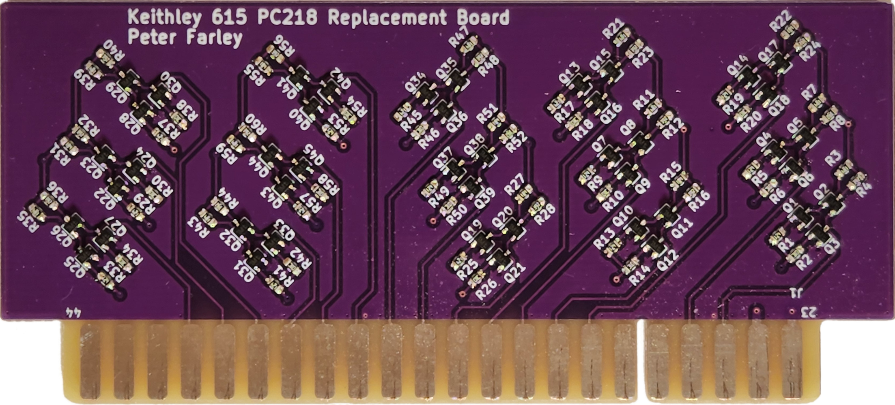
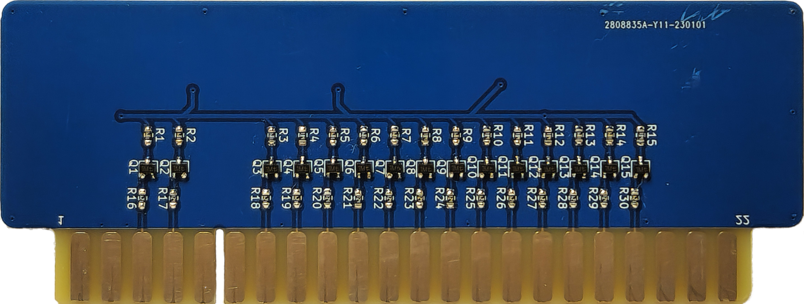
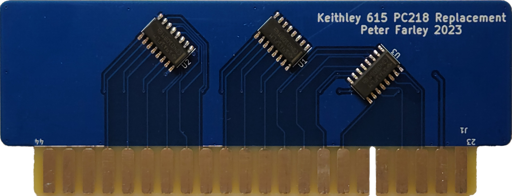

Keithley 615 Electrometer Printer Board Recreation
==================================================

This repo contains modern reproductions of the buffer/printer PCBs (PC209, PC218)
for the Keithley 615 electrometer.

Boards
------

 - PC218
   - Signal inverter/buffer board
   - Recreation of the origional PC218 schematic using modern SMD components is
     in the `PC218` directory
   - A simplified version using more modern ICs can be found in the `PC218v2` directory
 - PC209
   - Signal inverter/buffer and trigger board
   - Simplified version of the origional board can be found in the `PC209` directory
     - A faithful recreation of the origional board would require sourcing old
       parts that are no longer manufactured, or reducing the ICs down to
       discrete transistor equivalents.
 - Digital Interface Board
   - This will be a new board designed to connect to the 615 via the 50-pin
     Centronics connector
   - Planned features:
     - Passive data collection
     - Active triggering
     - USB-serial
     - RS-232 via DE-9
     - Ethernet
     - Integrated logging?

Photos
------

PC218 v1.0:

PC218 v2.0:

